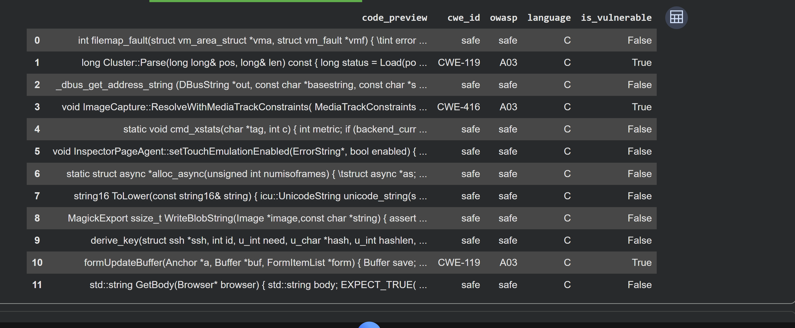
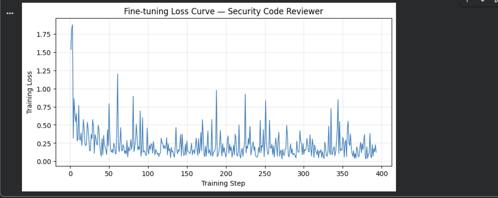
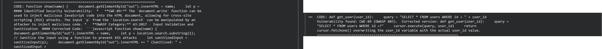
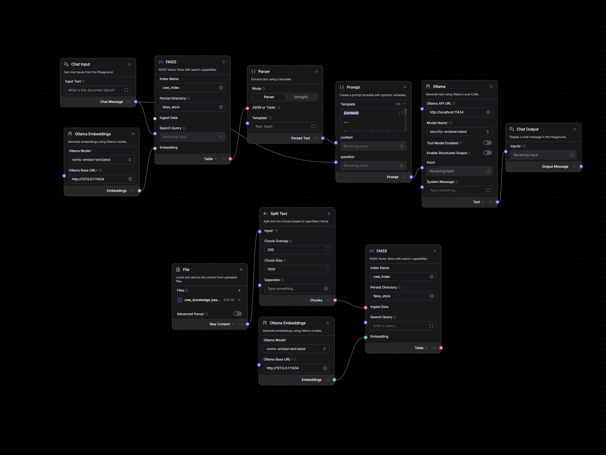
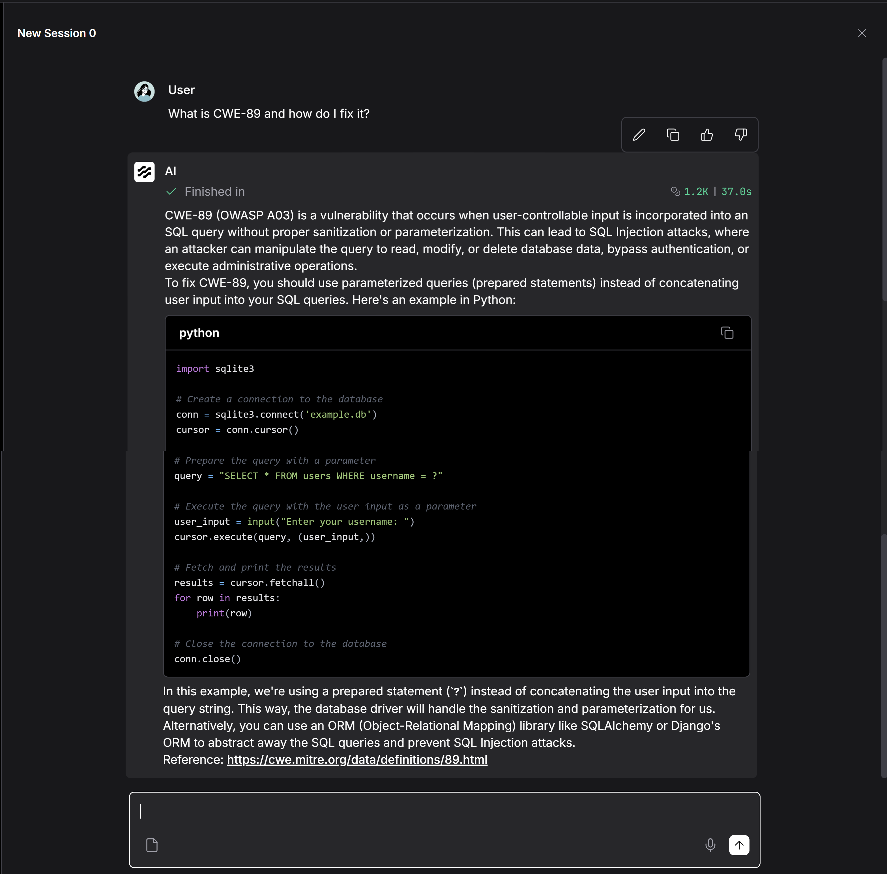

# Security Code Reviewer — Fine-Tuned LLM + RAG Pipeline

A domain-specialized AI that reviews source code for security vulnerabilities,
identifies the **CWE** and **OWASP** category, and produces a corrected version,
grounded in an authoritative CWE knowledge base with **cited sources**.

Built by fine-tuning a base LLM into a security specialist, deploying it locally,
and layering a Retrieval-Augmented Generation (RAG) pipeline on top so every answer
is backed by a real reference.

---

## Overview

The project combines two complementary techniques:

- **Fine-tuning** adapts a base model to *behave* like a security code reviewer,
  classifying vulnerabilities by CWE/OWASP and generating fixes in a consistent format.
- **RAG** layers an authoritative CWE reference knowledge base on top, so answers
  include accurate descriptions and cite their sources at query time.

The core idea it demonstrates: **fine-tuning controls *how* a model responds
(knowledge baked into weights), while RAG controls *what* it knows (knowledge
retrieved at query time).** A specialized assistant benefits from both.

---

## Stack

| Component | Tool |
|-----------|------|
| Base model | Llama 3.2 3B Instruct |
| Fine-tuning | Unsloth (LoRA) |
| Training data | Code security vulnerability dataset (CWE/OWASP labeled) |
| Local serving | Ollama (GGUF, q4_k_m) |
| Embeddings | nomic-embed-text |
| Vector store | FAISS |
| RAG orchestration | LangFlow |

---

## Dataset

The model was fine-tuned on a code-security vulnerability dataset labeled with
CWE IDs, OWASP categories, language, and a vulnerability flag, with a balanced
slice across 15 vulnerability classes plus safe samples.

---

## Training

Fine-tuned with Unsloth (LoRA) for one epoch. The training loss dropped from ~1.8
to a stable ~0.1-0.2 band, showing clean convergence.

---

## Results: Base vs Fine-Tuned

The same security questions, asked to the base model and the fine-tuned model.
The base model is verbose and often mislabels the vulnerability; the fine-tuned
model gives concise, correctly-labeled assessments with working fixes.

---

## RAG Pipeline

A LangFlow pipeline ingests a CWE knowledge base, embeds it (nomic-embed-text),
stores it in FAISS, and answers queries using the **fine-tuned model**, grounding
each response in retrieved references.

With RAG, each answer is grounded in the retrieved reference and cites its source.
For example, linking to the relevant MITRE CWE entry.

---

## Pipeline Summary

**Fine-tuning:** balanced dataset slice -> Alpaca-format training -> LoRA fine-tune
with Unsloth -> export to GGUF -> deploy via Ollama.

**RAG:** CWE knowledge base -> chunk -> embed (nomic-embed-text) -> FAISS vector store ->
retrieve on query -> answer with the fine-tuned model, citing the source.

---

## Repository Contents

- `notebook/` — Unsloth fine-tuning notebook (`.ipynb`)
- `data/` — CWE knowledge base used for RAG
- `langflow/` — RAG pipeline export (JSON)
- `screenshots/` — project screenshots
